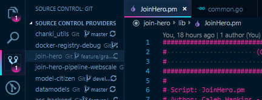
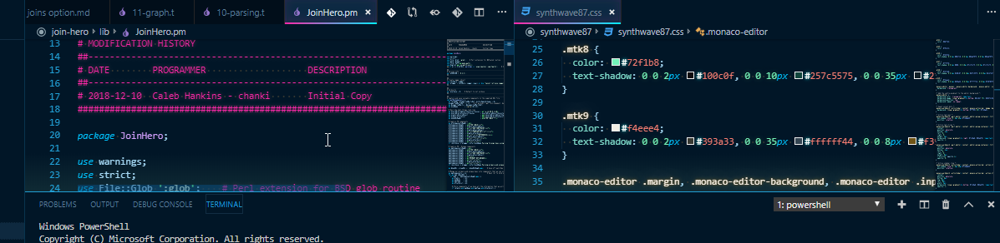
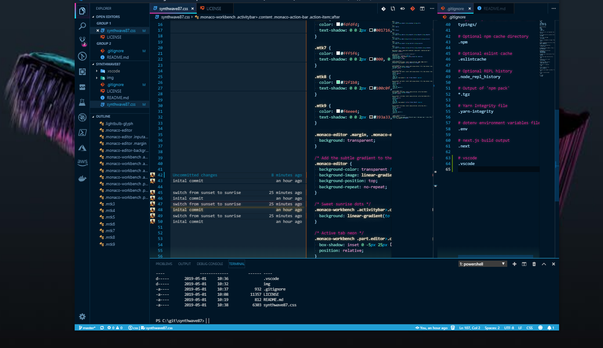

# synthwave84 css fork for vscode
*An Unholy Mashup Of Two Better vscode Themes To Create A Mess Only A Mother Could Love*

- I'm using John Papa's [Winter is Coming (Dark Blue)](https://marketplace.visualstudio.com/items?itemName=johnpapa.winteriscoming) Code theme as a base
- [Custom CSS](synthwave87.css) forked from the way better [SynthWave '84 Code theme](https://marketplace.visualstudio.com/items?itemName=RobbOwen.synthwave-vscode)
- Custom CSS applied via [Custom CSS and JS Loader](https://marketplace.visualstudio.com/items?itemName=be5invis.vscode-custom-css)

This repo mainly exists so I can revert to a previous config after deciding that it was way better than whatever fresh new hell I came up with.

## Screenshots
- 
-  
-  